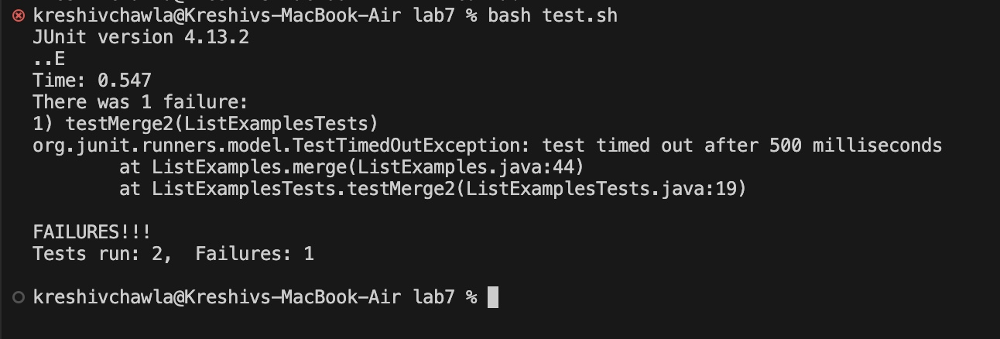
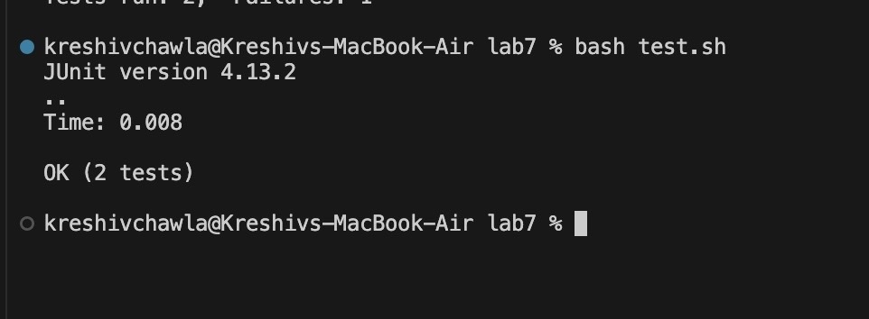
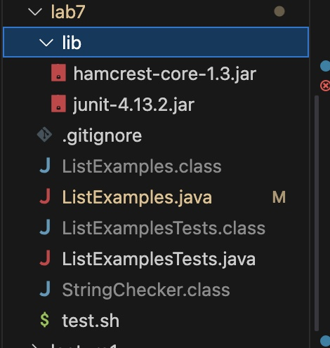

# lab-rep5

## PART 1

bug- sympotm and ss
response - hwo to fix
result after fixing.

BUG:

getting an error when using a bash file to run tests for a java file.
error shows that a test failed. unsure if there an issue with the java file or the test file.
the test file and java file attached below

response:

u should go over the java file and find the bug there. the test file is correct. try looking at the merge function.

reply from student:
i found the bug! both my tests are passing now

file directory structre-

contents of test.sh file-

contents of test java file-

commands used in terminal-
bash test.sh to run the bash file which contained the commands to compile both files and run the test file.

java file before fixing bug-

java file after fixing bug-

## PART 2

REFLECTION:

This class was the first time i had ever properly worked with terminal. it took some time for me to understand the concepcts at the beginning, but soon i had a good grasp on the topics. one aspect about this class which i found very interessting was using `vim` . being able to edit whole files form the terminal itself was a really quick and cool way to fix small bugs. overall this this class helped me learn a lot about directories and terminal commands. the practical lab work was also an amazing aspect.
